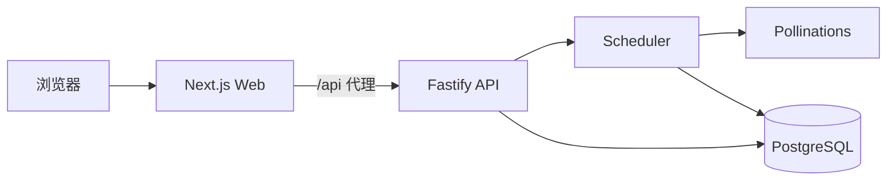

# Image Set Studio

轻量级套图生成工作台。输入主题、角色设定与风格约束后，系统会自动完成套图规划、提示词生成、批量出图与任务追踪。

## 项目特性

- 批量套图生成：支持主题、角色画像、风格预设、画幅比例、连贯度、服装变化策略等配置。
- 异步任务流水线：后端按「规划 -> 提示词 -> 生图」的顺序执行，适合多张图成组生成。
- 任务管理完整：支持历史任务列表、详情页、自动刷新、失败重试、单图重试。
- 多语言界面：内置简体中文、繁体中文、英文、日文。
- Pollinations 单通道：前端在设置页填写 API Key，并可拉取规划模型、提示词模型、生图模型。
- 数据持久化：使用 PostgreSQL 保存任务、计划项、提示词、图片结果与事件日志。
- Docker 部署现成：已提供 `Dockerfile`、`docker-compose.yml` 与部署说明。

## 技术栈

| 层 | 技术 |
| --- | --- |
| Web | Next.js 16、React 19、TypeScript |
| API | Fastify 5、TypeScript |
| Shared | Zod 契约、共享类型与运行时默认配置 |
| Database | PostgreSQL + Prisma |
| Test | Vitest |
| Runtime | Node.js 22、pnpm 10 |

## 工作流概览



用户在浏览器中配置 Pollinations Key 并提交套图任务，后端会将每个任务拆成规划项，生成提示词，再批量请求图片接口，最终在任务详情页中查看结果与日志。

## 核心页面

- `/`：新建套图任务。
- `/jobs`：历史任务列表与分页浏览。
- `/jobs/[id]`：查看规划、提示词、图片、事件日志，并执行重试。
- `/settings`：填写 Pollinations API Key，拉取并保存模型配置。

## 本地开发

### 1. 安装依赖

```bash
pnpm install
```

### 2. 配置后端环境变量

复制根目录模板到 `apps/api/.env`：

```bash
cp .env.example apps/api/.env
```

至少需要修改这些值：

- `DATABASE_URL`
- `CONFIG_ENCRYPTION_KEY`

可使用以下命令生成随机加密密钥：

```bash
openssl rand -hex 32
```

### 3. 配置前端本地代理

创建 `apps/web/.env.local`：

```dotenv
NEXT_PUBLIC_API_BASE_URL="/api"
API_PROXY_TARGET="http://127.0.0.1:4000"
```

### 4. 初始化数据库结构

当前仓库没有提交 Prisma migration 历史，本地开发建议直接同步 schema：

```bash
pnpm prisma:generate
pnpm --filter @image-set-studio/api exec prisma db push --schema ../../prisma/schema.prisma
```

### 5. 启动前后端

```bash
pnpm dev
```

默认访问地址：

- Web: `http://127.0.0.1:3000`
- API: `http://127.0.0.1:4000`

## 使用方式

1. 打开设置页 `/settings`。
2. 填写 Pollinations API Key。
3. 拉取可用模型并保存配置。
4. 返回首页填写主题、角色设定与套图参数。
5. 提交任务后，在 `/jobs` 或 `/jobs/[id]` 查看执行状态与结果。

## Docker Compose 部署

如果你希望直接部署整套服务，可以使用仓库内的 Compose 配置。

```bash
cp docker-compose.env.example .env
docker compose build --pull
docker compose up -d
```

部署前至少修改：

- `POSTGRES_PASSWORD`
- `CONFIG_ENCRYPTION_KEY`
- `WEB_PORT`

Compose 默认行为：

- 只对外暴露 `web` 端口。
- 浏览器访问 `/api/*` 时由 Next.js 反向代理到 `api` 服务。
- `api` 容器启动时会先执行 `prisma db push`，如果 schema 不兼容会直接失败并暴露日志。

更完整的部署步骤见 [DEPLOYMENT.md](./DEPLOYMENT.md)。

## API 概览

| 方法 | 路径 | 说明 |
| --- | --- | --- |
| `GET` | `/health` | 健康检查 |
| `GET` | `/api/runtime-defaults` | 获取默认运行时配置 |
| `POST` | `/api/image-set-jobs` | 创建套图任务 |
| `GET` | `/api/image-set-jobs` | 分页查询当前浏览器拥有的任务 |
| `GET` | `/api/image-set-jobs/:id` | 获取任务详情 |
| `POST` | `/api/image-set-jobs/:id/retry-failed` | 重试失败项 |
| `POST` | `/api/image-set-jobs/:id/images/:imageIndex/retry` | 重试单张图片 |
| `POST` | `/api/image-set-jobs/:id/cancel` | 取消任务 |
| `GET` | `/api/image-set-jobs/:id/images/:imageIndex/content` | 代理返回受控图片内容 |

## 仓库结构

```text
.
├── apps
│   ├── api          # Fastify API 与任务调度
│   └── web          # Next.js 前端
├── packages
│   └── shared       # 共享 schema、类型与默认值
├── prisma           # Prisma schema
├── docker           # 容器启动脚本
├── Dockerfile
├── docker-compose.yml
└── DEPLOYMENT.md
```

## 安全说明

- Pollinations API Key 由前端设置页录入，并保存在当前浏览器本地。
- 后端要求 `X-Client-Token` 识别任务归属，不同浏览器之间默认隔离。
- 服务端会对任务解析后的运行时配置进行加密后再持久化。

## 常用命令

```bash
pnpm dev
pnpm build
pnpm test
pnpm prisma:generate
pnpm prisma:migrate
```
